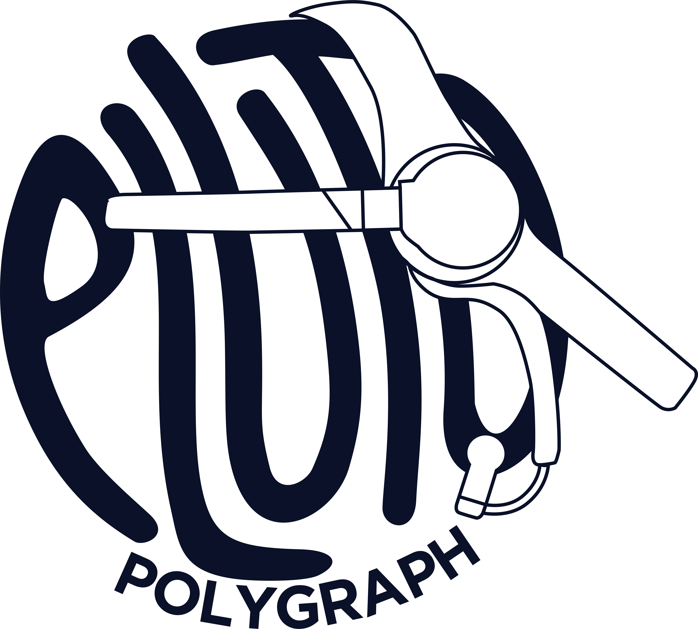

# Pluto Polygraph
Pluto Polygraph is a web-based lie detector application that uses a brainwave headset to pick up EEG (Electroencephalography) signals in the brain. Pluto Polygraph uses Deep Learning technology to perform the detection process with the Long-Short Term Memory (LSTM) algorithm. The model on the Pluto Polygraph knows with a dataset the human brain's EEG signals.

Pluto Polygraph was built for the purposes of scientific investigation and research. This website is built with Python's Flask technology and Mysql database. With a dynamic and attractive appearance, it can simplify the analysis of lie detection on the web.

## Requirements
1. Software :
- OS (Windows/Linux/Mac).
- Python (2.x/3.x).
- XAMPP (Any Version).
- Visual Studio Code or others.
- Web Browser (Chrome, Firefox, MS Edge).
2. Hardware :
- Device Laptop or Personal Computer.
- Neurosky Mindwave Headset.
- Mouse (I/O).
- Monitor (I/O).
- Keyboard (I/O).
3. Skills :
- Have an understanding of computer and web interfaces.
- Have an understanding of the polygraph process or lie detector in general.
- Have an understanding of the interview or interrogation process, as well as the general examination process.
